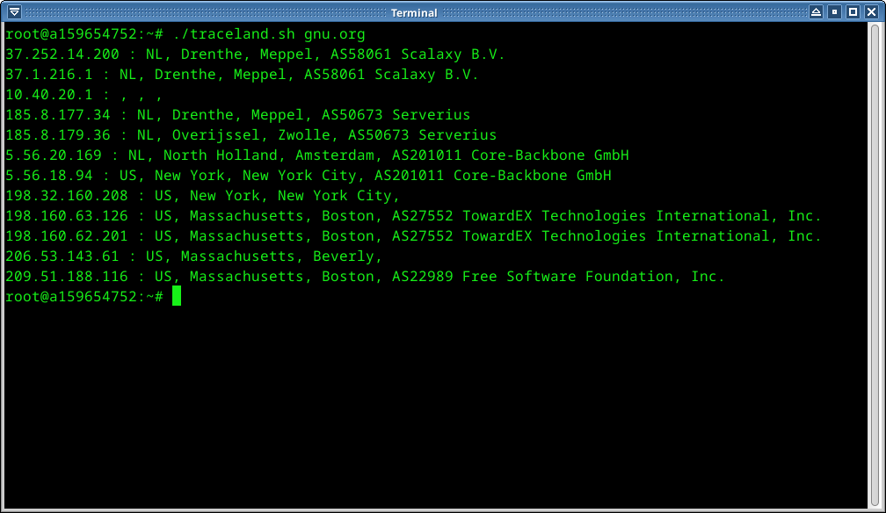

### About:
traceland.sh is script which shows countries, cities and isps using traceroute and ipinfo.io

### Example:
This is the example of tracing from VPS of the Netherland to the gnu.org

### Requrements:
1. curl
2. jq
